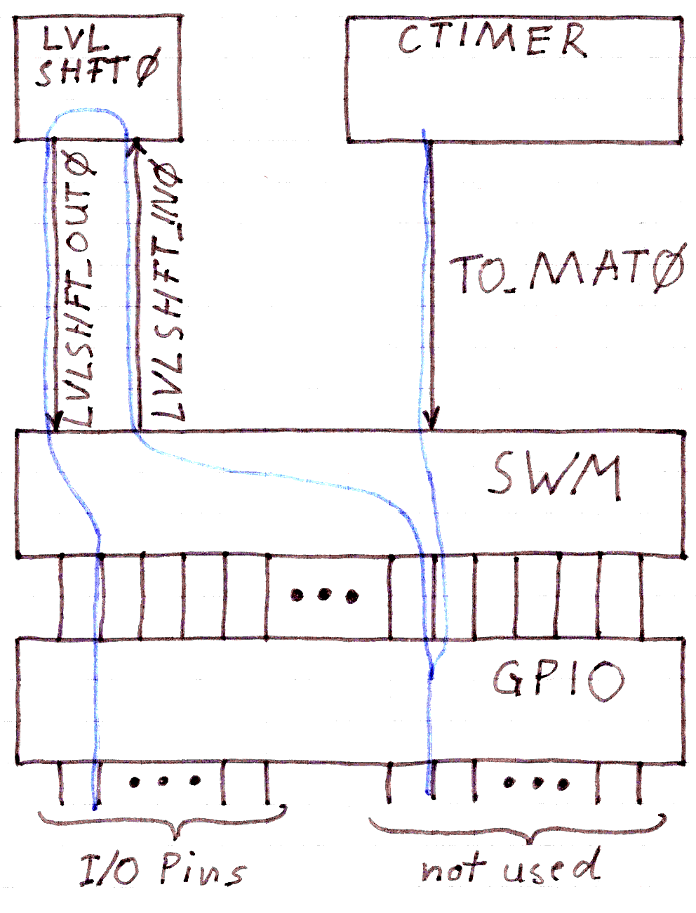

# CTIMER and LVLSHFT Example

 * USB UART Converter is connected to pins 6 and 19 of the LPC804
 * A switch at pin 4 selects between in-system programming and user code mode
 * A button at pin 5 will reset the LPC804 and either start the ISP bootloader or the user code (depending on the state at pin 4)
 * This example will use the LED at pin 15
 * CTIMER is put into PWM mode, PWM outout at unconnected PIO0_30
 * LVLSHFT0 connects PIO0_15 to PIO0_30

