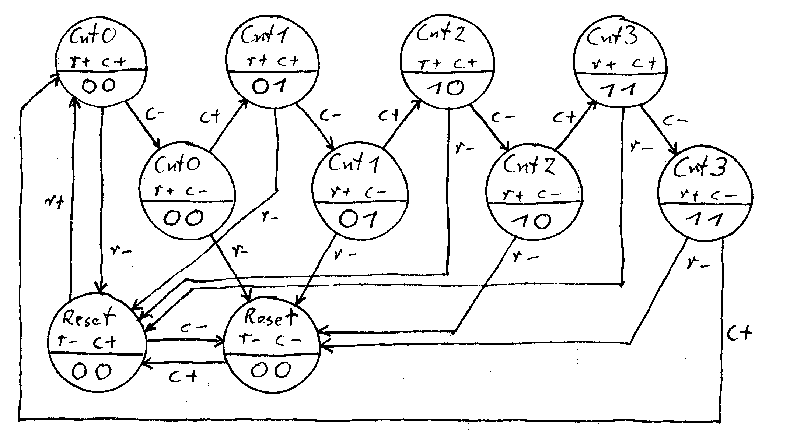
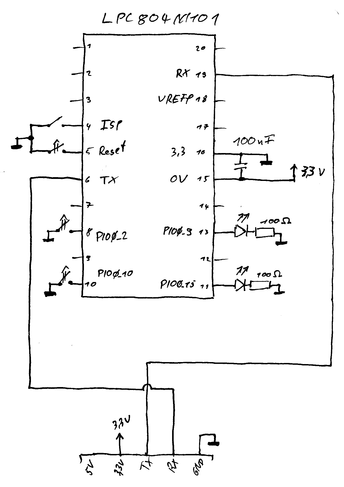

# Binary 2 Bit Counter

 * Post: [https://drolliblog.wordpress.com/2019/10/13/bms-binary-counter-debounce-and-lpc804-plu/](https://drolliblog.wordpress.com/2019/10/13/bms-binary-counter-debounce-and-lpc804-plu/)
 * USB UART Converter is connected to pins 6 and 19 of the LPC804
 * This example will use the LEDs at pin PIO0_15 and PIO0_9
 * Assums buttons at PIO0_2 and PIO0_10
 * Implements a binary 2 bit counter, inputs "r" (PIO0_2) and "c" (PIO0_10), output "led0" (PIO0_9) and "led1" (PIO0_10)
 * The clock signal for the PLU state machine is derived from the low power oscillator and divided by 250 (button debounce)
 * Code generation: `../../tools/pluc/pluc count.bex count.bms -lposc -clkdiv 250 -oc plu.c -fn plu`

