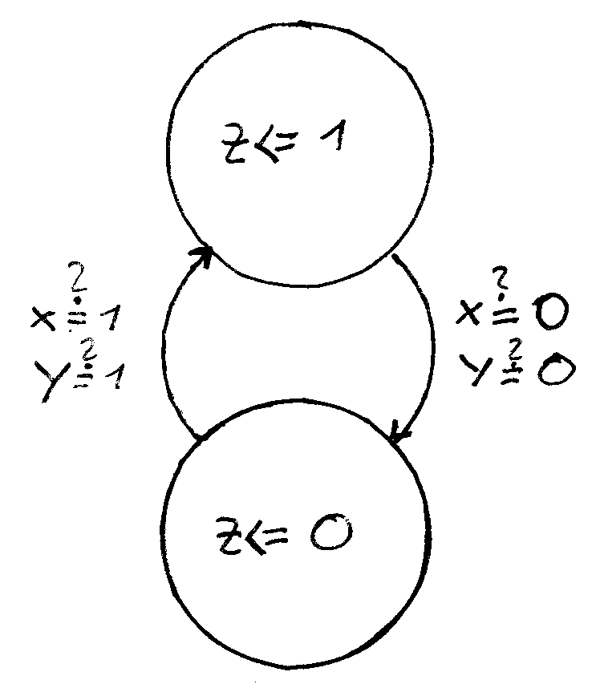
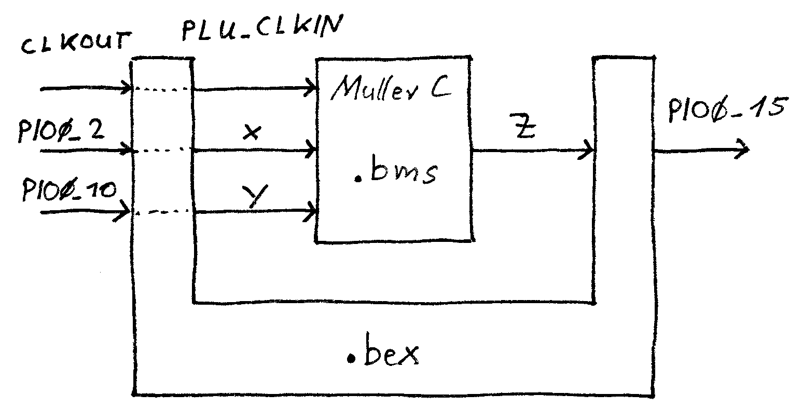

# Muller-C State Machine Example

 * Post: [https://drolliblog.wordpress.com/2019/10/05/nxp-lpc804-plu-lut-configuration/](https://drolliblog.wordpress.com/2019/10/05/nxp-lpc804-plu-lut-configuration/)
 * USB UART Converter is connected to pins 6 and 19 of the LPC804
 * This example will use the LED at pin PIO0_15
 * Assums buttons at PIO0_2 and PIO0_10
 * Implements Muller-C state machine, inputs "x" (PIO0_2) and "y" (PIO0_10), output "z" (PIO0_15)

