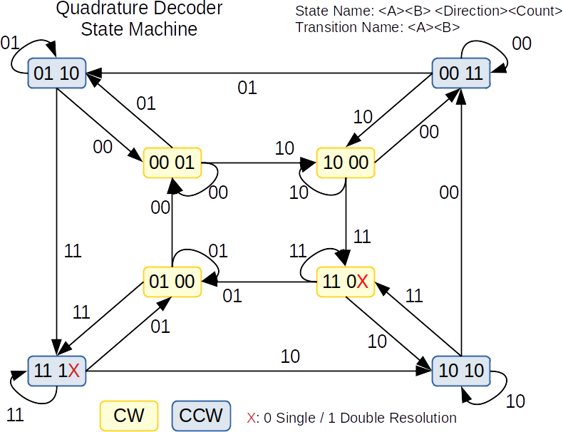

# Quadrature Decoder for a Rotary Encoder Input Device

 * Put a quadraature decoder into PLU to get the direction and count pulses of a rotary encoder
 * The state machine (see below) is implemented as .kiss file
 * The state machine has two inputs from the rotary encoder (A and B) and
 generates two output signals (direction and count pulse)
 * Output signals are mapped to unused GPIO pins
 * Software observes the rising/falling edge of the count pulse via pin interrupt
 * Output via USART interface
 

