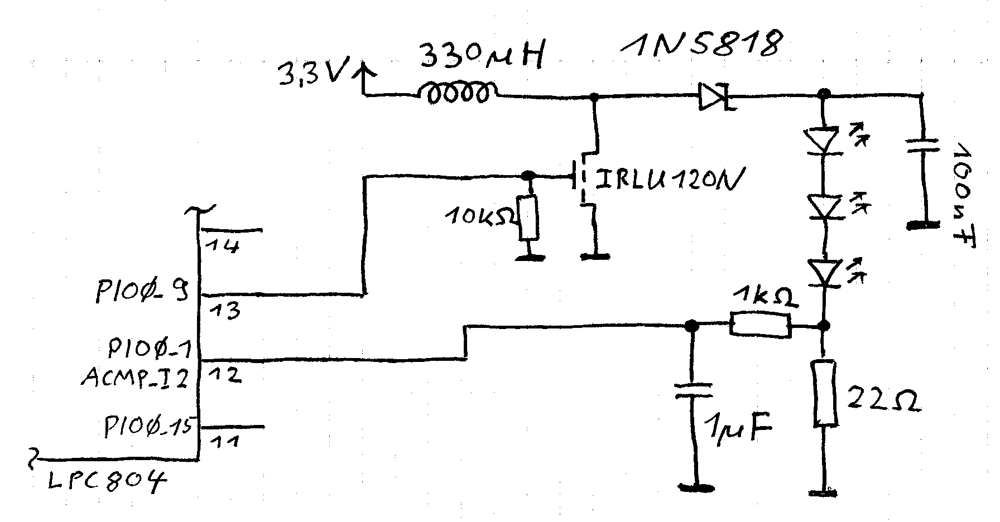
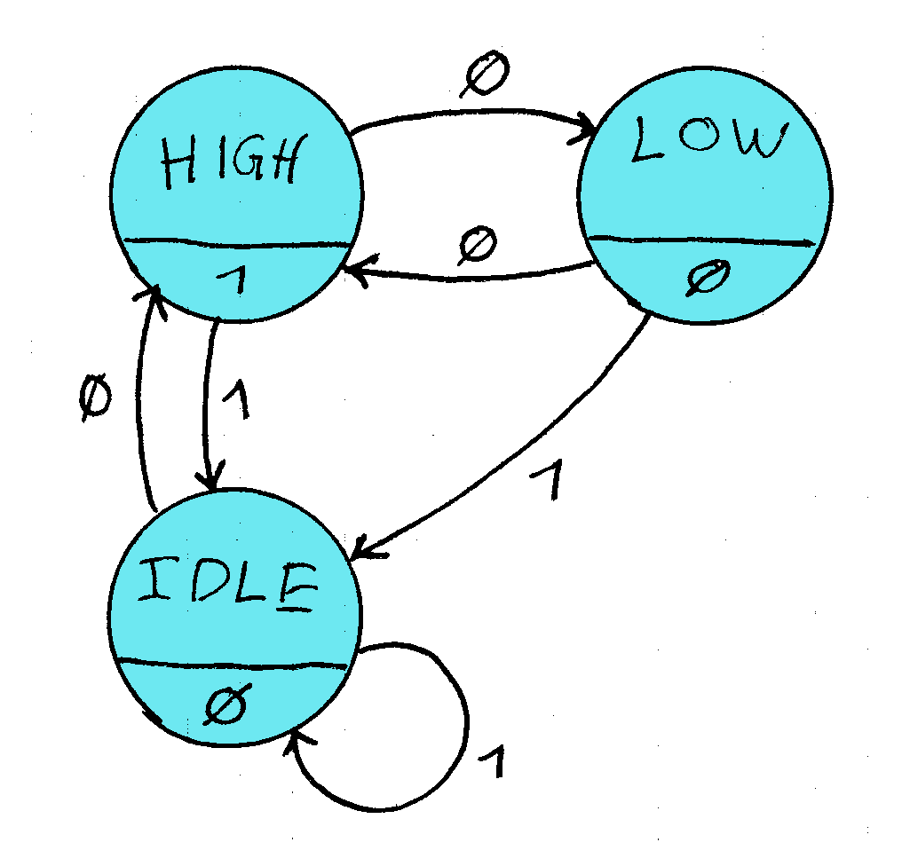

# Step Up (Boost) converter with the LPC804 PLU

 * Post: [https://drolliblog.wordpress.com/2019/10/31/nxp-lpc804-plu-step-up-converter/](https://drolliblog.wordpress.com/2019/10/31/nxp-lpc804-plu-step-up-converter/)
 * USB UART Converter is connected to pins 6 and 19 of the LPC804
 * PIO0_9: Input to the MOSFET gate of the step up converter
 * PIO0_1: Analog comparator input
 * Implements a step up converter to generate 6V out of 3.3V for three LEDs
 * The clock signal for the PLU state machine is derived from the low power oscillator and divided by 20 (50kHz)
 

