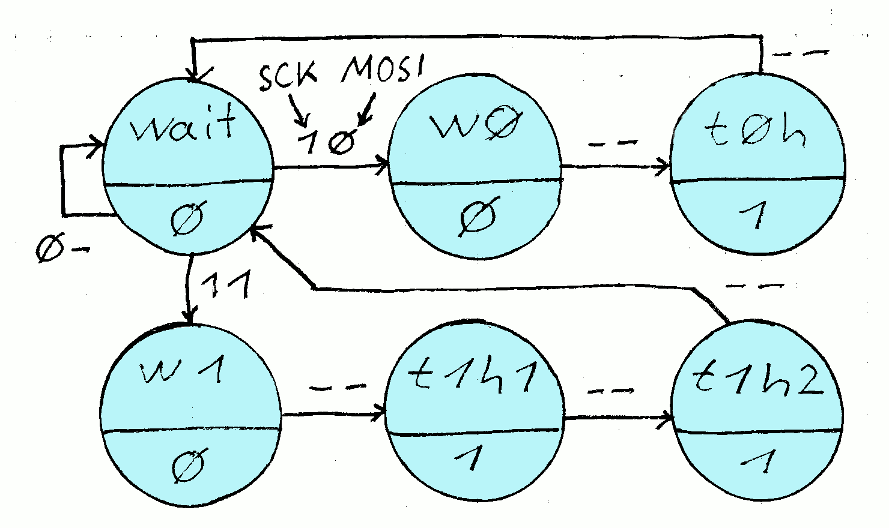

# LPC804 as a WS2812b controller

 * USB UART Converter is connected to pins 6 and 19 of the LPC804
 * This example generates the data for WS2812b LEDs at PIO0_8
 * Currently only two LEDs are supported 
 * The PLU contains a state machine (KISS) to generate the WS2812b waveform
 * The PLU acts as a SPI client and receives RGB data via LPC804 SPI subsystem
 * The file "plu_setup.c" is usually generated, but is also added to the repo

