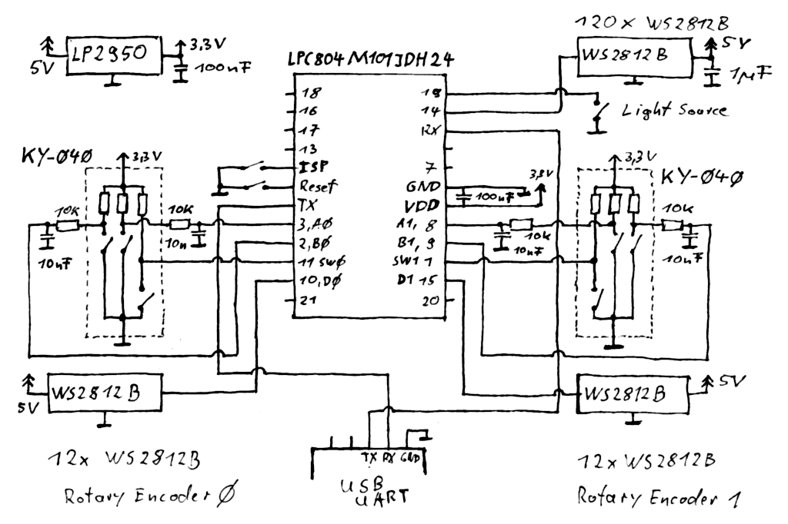

# WS2812B Controller

 * 2x Rotary Encoder with 2x 12x WS2812B Ring LED
 * Output to 120x WS2812B LED 
 * Places 4 independed lights on the target LEDs
 * Each of the four lights can have any width, position and color
 * Color defined with HSV or Kelvon mode
 * Rotary Controller 0, HSV Mode Short Press: Cycle through H, S and V
 * Rotary Controller 0, Kelvin Mode Short Press: Switch between Kelvin and Brightness
 * Rotary Controller 0, Long Press: Switch between HSV and Kelvin mode
 * Rotary Controller 1, Short Press: Switch between position and width
 * Middle Button Short Press: Cycle through the four light sources
 * Middle Button Long Press: Store setup in Flash ROM (will be loaded during power up)
 
 

